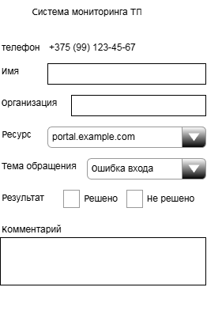
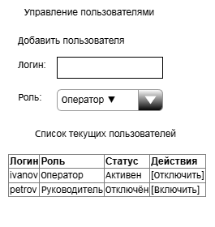

# Спецификация требований к программному обеспечению  
## Система мониторинга технической поддержки

**Версия**: 1.0  
**Дата**: 25 января 2026 г.  
**Автор**: [Мигулин Данил]

---

## Содержание
- [0 Глоссарий](#0-глоссарий)
- [1 Введение](#1-введение)
  - [1.1 Назначение](#11-назначение)
  - [1.2 Бизнес-требования](#12-бизнес-требования)
    - [1.2.1 Исходные данные](#121-исходные-данные)
    - [1.2.2 Возможности бизнеса](#122-возможности-бизнеса)
    - [1.2.3 Границы проекта](#123-границы-проекта)
  - [1.3 Аналоги](#13-аналоги)
- [2 Требования пользователя](#2-требования-пользователя)
  - [2.1 Программные интерфейсы](#21-программные-интерфейсы)
  - [2.2 Интерфейс пользователя](#22-интерфейс-пользователя)
  - [2.3 Характеристики пользователей](#23-характеристики-пользователей)
    - [2.3.1 Классы пользователей](#231-классы-пользователей)
    - [2.3.2 Аудитория приложения](#232-аудитория-приложения)
      - [2.3.2.1 Целевая аудитория](#2321-целевая-аудитория)
      - [2.3.2.2 Побочная аудитория](#2322-побочная-аудитория)
  - [2.4 Предположения и зависимости](#24-предположения-и-зависимости)
- [3 Системные требования](#3-системные-требования)
  - [3.1 Функциональные требования](#31-функциональные-требования)
  - [3.2 Нефункциональные требования](#32-нефункциональные-требования)
    - [3.2.1 Атрибуты качества](#321-атрибуты-качества)
      - [3.2.1.1 Требования к доступности](#3211-требования-к-доступности)
      - [3.2.1.2 Требования к масштабируемости](#3212-требования-к-масштабируемости)
      - [3.2.1.3 Требования к удобству использования](#3213-требования-к-удобству-использования)
      - [3.2.1.4 Требования к расширяемости](#3214-требования-к-расширяемости)
      - [3.2.1.5 Требования к безопасности](#3215-требования-к-безопасности)
      - [3.2.1.6 Требования к надёжности](#3216-требования-к-надёжности)
    - [3.2.2 Юридические требования](#322-юридические-требования)
    - [3.2.3 Ограничения](#323-ограничения)
    - [3.2.4 Критерий успеха](#324-критерий-успеха)

<a name="0-глоссарий"/>

## 0 Глоссарий

| Термин | Определение |
|--------|------------|
| **Asterisk** | Открытая платформа IP-телефонии, обрабатывающая SIP-звонки |
| **AMI** | Asterisk Manager Interface — протокол для получения событий о звонках |
| **Call-центр** | Отдел технической поддержки, обрабатывающий входящие звонки |
| **Оператор** | Сотрудник call-центра, принимающий звонки |
| **Руководитель** | Руководитель call-центра, анализирующий эффективность работы |
| **Клиент** | Абонент, совершающий звонок в техподдержку |
| **Карточка клиента** | Запись в системе, содержащая основные данные клиента (имя, организация) |
| **Обращение** | Отдельное взаимодействие клиента с оператором (тема, ресурс, результат) |
| **Очередь** | Группа операторов, обслуживающих входящие вызовы в Asterisk |
| **Рабочее время** | Интервал, в течение которого звонки считаются рабочими (настраивается администратором) |
| **Пропущенный звонок** | Звонок, который не был соединён с оператором: либо клиент повесил трубку до ответа, либо прошло более 30 секунд ожидания в очереди (в рабочее время) |

<a name="1-введение"/>

## 1 Введение

<a name="11-назначение"/>

### 1.1 Назначение
Данный документ описывает требования к веб-приложению «Система мониторинга технической поддержки». Документ предназначен для команды, которая будет реализовывать и проверять корректность работы приложения.

<a name="12-бизнес-требования"/>

### 1.2 Бизнес-требования

<a name="121-исходные-данные"/>

#### 1.2.1 Исходные данные
В call-центре технической поддержки возникает необходимость в автоматическом сборе и анализе данных о звонках. Операторы тратят время на ручной учёт, руководство не имеет прозрачной статистики. Существует потребность в системе, которая будет решать эту проблему.

<a name="122-возможности-бизнеса"/>

#### 1.2.2 Возможности бизнеса
Система позволит:
- Повысить качество обслуживания за счёт аналитики,
- Уменьшить время на ручной учёт,
- Принимать управленческие решения на основе данных.

<a name="123-границы-проекта"/>

#### 1.2.3 Границы проекта
Система «Мониторинг технической поддержки»:
- **Входит**: сбор событий из Asterisk, ведение карточек клиентов и истории обращений, аналитика, экспорт отчётов.
- **Не входит**: настройка Asterisk (SIP-устройства, диалплан, очереди), интеграция с внешними CRM.

<a name="13-аналоги"/>

### 1.3 Аналоги
| Система     | Сильные стороны              | Недостатки                                    |
| ----------- | ---------------------------- | --------------------------------------------- |
| **FreePBX** | Полноценная админка Asterisk | Сфокусирована на настройке, а не на аналитике |
| **3CX**     | Готовое решение «под ключ»   | Коммерческая, закрытая архитектура            |

> **Вывод**: существующие решения либо слишком технические, либо коммерческие. Наш продукт заполняет нишу лёгкой аналитики для небольшого call-центра.

<a name="2-требования-пользователя"/>

## 2 Требования пользователя

<a name="21-программные-интерфейсы"/>

### 2.1 Программные интерфейсы
Система взаимодействует со следующими внешними компонентами:
- **Asterisk** — через AMI (порт 5038),
- **PostgreSQL** — основная СУБД,
- **Spring Boot** — backend-фреймворк,
- **Thymeleaf** — шаблонизатор.

<a name="22-интерфейс-пользователя"/>

### 2.2 Интерфейс пользователя

Система предоставляет веб-интерфейс:

- **Оператор**: форма карточки клиента и обращения (имя, ресурс, тема, результат, комментарий)  
  |  |
  |:--:|
  | *Рисунок 1 — Вид оператора* |

- **Руководитель**: таблица звонков, дашборд, фильтры, экспорт CSV  
  |  |
  |:--:|
  | *Рисунок 2 — Вид руководителя* |

- **Администратор**: управление пользователями и настройка рабочего времени  
  |  |
  |:--:|
  | *Рисунок 3 — Вид администратора* |

### 2.3 Характеристики пользователей

<a name="231-классы-пользователей"/>

#### 2.3.1 Классы пользователей
| Класс | Описание |
|------|--------|
| **Оператор** | Обрабатывает звонки, заполняет карточки и обращения |
| **Руководитель** | Анализирует эффективность, формирует отчёты |
| **Администратор** | Управляет пользователями и настройками |

<a name="232-аудитория-приложения"/>

#### 2.3.2 Аудитория приложения

<a name="2321-целевая-аудитория"/>

##### 2.3.2.1 Целевая аудитория
Операторы и руководители call-центров технической поддержки.

<a name="2322-побочная-аудитория"/>

##### 2.3.2.2 Побочная аудитория
Администраторы ИТ-инфраструктуры, студенты, изучающие интеграцию с Asterisk.

<a name="24-предположения-и-зависимости"/>

### 2.4 Предположения и зависимости
- Сервер Asterisk предварительно настроен и доступен по сети.
- Все операторы зарегистрированы в одной очереди (`support`).
- Рабочее время настраивается администратором и хранится в БД.
- Для демонстрации используется Docker-контейнер с Asterisk.

<a name="3-системные-требования"/>

## 3 Системные требования

<a name="31-функциональные-требования"/>

### 3.1 Функциональные требования

| ID         | Требование                                                                                                                                  |
| ---------- | ------------------------------------------------------------------------------------------------------------------------------------------- |
| **3.1.1**  | Администратор может создавать учётные записи пользователей с назначением ролей: «оператор», «руководитель», «администратор».                |
| **3.1.2**  | Администратор может настраивать рабочее время (начало и конец) через веб-интерфейс.                                                         |
| **3.1.3**  | При первом звонке с нового номера система автоматически создаёт карточку клиента.                                                           |
| **3.1.4**  | Оператор может заполнить основные данные в карточке клиента: имя, организацию (опционально).                                                |
| **3.1.5**  | При каждом звонке оператор может зафиксировать новое обращение: указать ресурс, тему, результат («решено» / «не решено»), комментарий.      |
| **3.1.6**  | История всех обращений клиента сохраняется и отображается в хронологическом порядке.                                                        |
| **3.1.7**  | Руководитель может просматривать все звонки и обращения по всем операторам и клиентам.                                                      |
| **3.1.8**  | Руководитель может фильтровать данные по дате, оператору, клиенту, ресурсу или статусу обращения.                                           |
| **3.1.9**  | Руководитель может просматривать статистику: количество принятых/пропущенных звонков, % решённых обращений, средняя длительность разговора. |
| **3.1.10** | Руководитель может экспортировать отчёты в формате CSV.                                                                                     |
| **3.1.11** | Система автоматически помечает звонки, сделанные вне рабочего времени, и исключает их из расчёта пропущенных.                               |

<a name="32-нефункциональные-требования"/>

### 3.2 Нефункциональные требования

<a name="321-атрибуты-качества"/>

#### 3.2.1 Атрибуты качества

<a name="3211-требования-к-доступности"/>

##### 3.2.1.1 Требования к доступности
Приложение должно быть доступно 99% времени в рабочие часы.  
*Измерение*: мониторинг uptime.

<a name="3212-требования-к-масштабируемости"/>

##### 3.2.1.2 Требования к масштабируемости
Система должна поддерживать до 100 звонков в час без деградации.  
*Измерение*: нагрузочное тестирование.

<a name="3213-требования-к-удобству-использования"/>

##### 3.2.1.3 Требования к удобству использования
Заполнение обращения должно занимать ≤3 кликов.  
*Измерение*: QA-оценка.

<a name="3214-требования-к-расширяемости"/>

##### 3.2.1.4 Требования к расширяемости
Архитектура позволяет добавить новые типы ресурсов или категории без переписывания ядра.  
*Измерение*: code review.

<a name="3215-требования-к-безопасности"/>

##### 3.2.1.5 Требования к безопасности
Доступ к данным ограничен ролями. Оператор не видит данные других операторов.  
*Измерение*: тест-кейсы на разграничение доступа.

<a name="3216-требования-к-надёжности"/>

##### 3.2.1.6 Требования к надёжности
Система должна автоматически переподключаться к Asterisk при разрыве.  
*Измерение*: имитация разрыва соединения.

<a name="322-юридические-требования"/>

#### 3.2.2 Юридические требования
- Система не нарушает лицензию Asterisk (GPL).
- Данные о звонках используются только в рамках call-центра.

<a name="323-ограничения"/>

#### 3.2.3 Ограничения
- Реализация на Java 17, Spring Boot 3.x.
- Используется только одна очередь Asterisk (`support`).

<a name="324-критерий-успеха"/>

#### 3.2.4 Критерий успеха
Система считается успешной, если:
1. Руководитель получает актуальную статистику,
2. Операторы заполняют обращения за ≤30 секунд,
3. Нет ошибок при обработке 100 звонков в час.