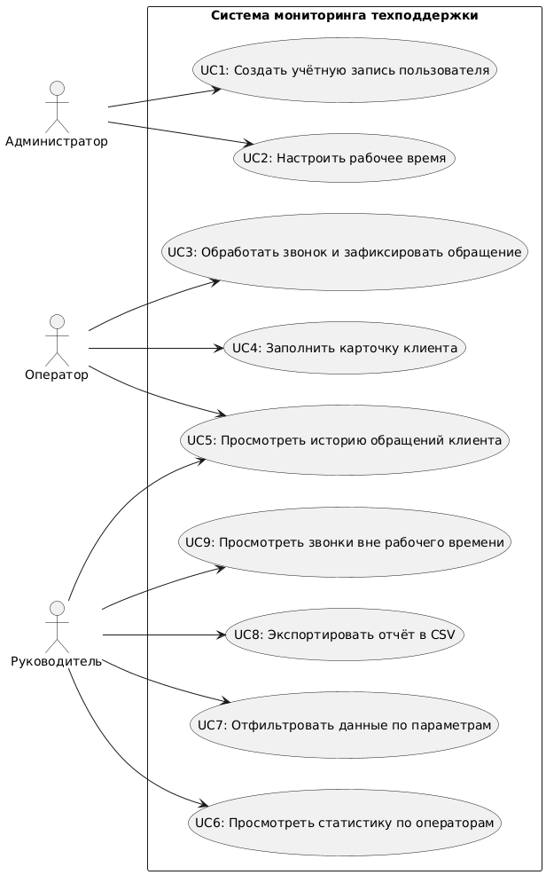

# Use Cases

## Диаграмма Use Case

Система поддерживает следующие варианты использования:

| ID | Название | Актёр | Описание |
|----|---------|------|----------|
| UC1 | Создать учётную запись пользователя | Администратор | Подробнее в [UC1-create-user.md](UC1-create-user.md) |
| UC2 | Настроить рабочее время | Администратор | Подробнее в [UC2-set-working-hours.md](UC2-set-working-hours.md) |
| UC3 | Обработать звонок и зафиксировать обращение | Оператор | Подробнее в [UC3-process-call.md](UC3-process-call.md) |
| UC4 | Заполнить карточку клиента | Оператор | Подробнее в [UC4-fill-client-card.md](UC4-fill-client-card.md) |
| UC5 | Просмотреть историю обращений клиента | Оператор, Руководитель | Подробнее в [UC5-view-interaction-history.md](UC5-view-interaction-history.md) |
| UC6 | Просмотреть статистику по операторам | Руководитель | Подробнее в [UC6-view-statistics.md](UC6-view-statistics.md) |
| UC7 | Отфильтровать данные по параметрам | Руководитель | Подробнее в [UC7-filter-data.md](UC7-filter-data.md) |
| UC8 | Экспортировать отчёт в CSV | Руководитель | Подробнее в [UC8-export-csv.md](UC8-export-csv.md) |
| UC9 | Просмотреть звонки вне рабочего времени | Руководитель | Подробнее в [UC9-view-out-of-hours.md](UC9-view-out-of-hours.md) |