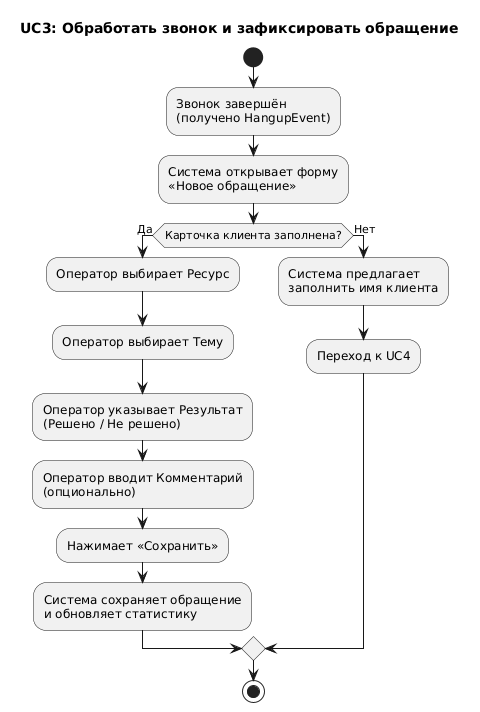
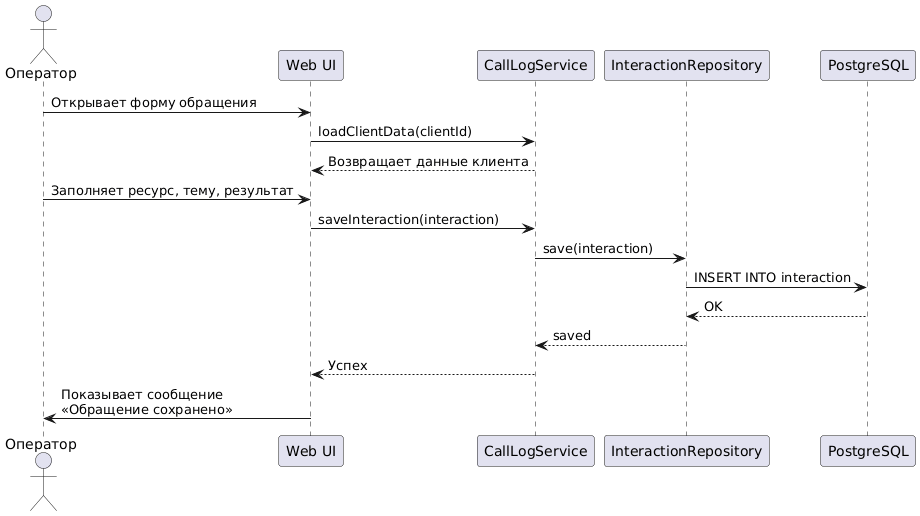
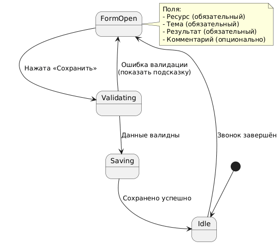

# UC3: Обработать звонок и зафиксировать обращение

## Актёр
Оператор

## Описание
После завершения входящего звонка оператор фиксирует данные о взаимодействии с клиентом.

## Предусловия
- Звонок завершён (получено событие `HangupEvent` от Asterisk).
- Клиент существует в системе.

## Основной поток событий (Flow of Events)
1. Система автоматически открывает форму «Новое обращение».
2. Оператор выбирает **Ресурс** из списка.
3. Оператор выбирает **Тему обращения**.
4. Оператор указывает **Результат**: «Решено» / «Не решено».
5. Оператор вводит **Комментарий** (опционально).
6. Оператор нажимает кнопку **«Сохранить»**.
7. Система сохраняет обращение и обновляет статистику.

## Альтернативные потоки
- **A1**: Если карточка клиента не содержит имени, система показывает предупреждение и предлагает перейти к UC4 (заполнение карточки).

## Постусловия
- Обращение сохранено в БД.
- Статистика оператора обновлена.
- Карточка клиента отображает новую запись в истории.

## Диаграммы

### Диаграмма активности (Activity Diagram)
Отражает последовательность действий оператора и системы.

### Диаграмма последовательности (Sequence Diagram)
Показывает взаимодействие компонентов: UI → Service → Repository → БД.

### Диаграмма состояний (State Diagram)
Описывает состояния формы «Новое обращение» (ожидание, валидация, сохранение).

