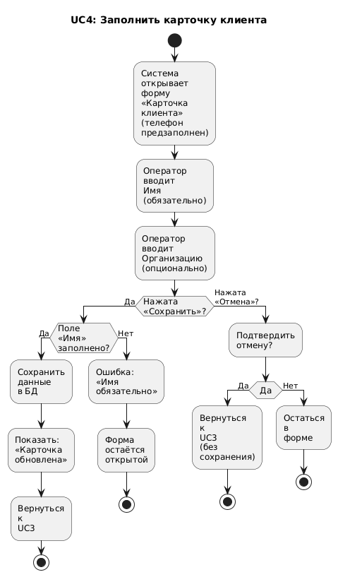
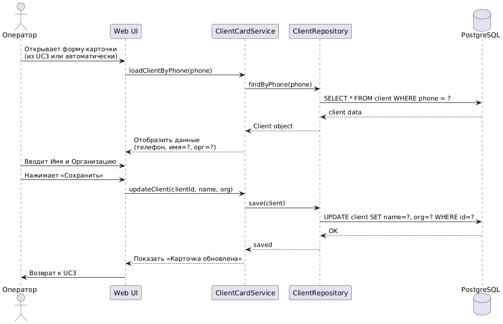

# UC4: Заполнить карточку клиента

## Актёр
Оператор

## Описание
При первом взаимодействии с клиентом или при обнаружении незаполненной карточки оператор указывает основные данные: имя (обязательно) и организацию (опционально).

## Предусловия
- Звонок завершён.
- Карточка клиента существует в системе (создана автоматически при первом звонке), но поля «Имя» и/или «Организация» пусты.

## Основной поток событий (Flow of Events)
1. Система открывает форму **«Карточка клиента»** с предзаполненным телефоном.
2. Оператор вводит **Имя клиента** в текстовое поле (обязательное).
3. Оператор вводит **Организацию** в текстовое поле (опционально).
4. Оператор нажимает кнопку **«Сохранить»**.
5. Система проверяет, что поле «Имя» не пустое.
6. Система сохраняет данные в базу данных.
7. Система отображает сообщение: **«Карточка клиента обновлена»**.
8. Система **возвращает оператора к форме обращения (UC3)**.

## Альтернативные потоки

### A1: Имя не указано
1. На шаге 5 система обнаруживает, что поле «Имя» пустое.
2. Система подсвечивает поле красным и показывает:  
   **«Имя клиента обязательно для заполнения»**.
3. Форма остаётся открытой; оператор может исправить ввод.

### A2: Отмена заполнения
1. Оператор нажимает кнопку **«Отмена»**.
2. Система спрашивает: **«Вы уверены? Без имени дальнейшая работа с обращением будет затруднена»**.
3. При подтверждении форма закрывается, и оператор **возвращается к UC3**, где карточка остаётся незаполненной.

## Постусловия
- Карточка клиента содержит актуальные данные (имя обязательно, организация — опционально).
- При последующих звонках с этого номера имя клиента отображается автоматически.
- Все будущие обращения привязываются к этой карточке.
- Оператор возвращается к сценарию UC3 для завершения фиксации обращения.

## Диаграммы

### Диаграмма активности

### Диаграмма последовательности

### Диаграмма состояний
